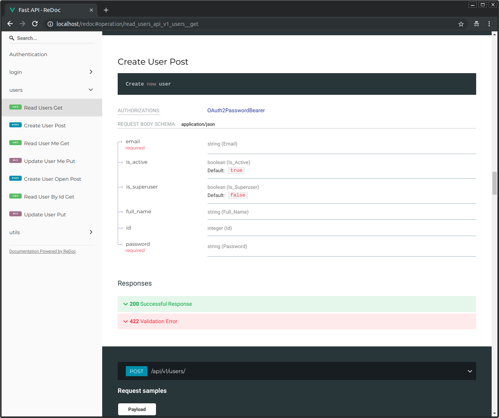

# AsyncFastAPI Full Stack Project

Generate a backend and frontend stack using Python, including interactive API documentation.

### Interactive API documentation

[](https://github.com/johnson2427/AsyncFastAPI)

### Alternative API documentation

[](https://github.com/johnson2427/AsyncFastAPI)

## Features

* Full **Docker** integration (Docker based).
* Docker Swarm Mode deployment.
* **Docker Compose** integration and optimization for local development.
* **Production ready** Python web server using Uvicorn and Gunicorn.
* Python <a href="https://github.com/tiangolo/fastapi" class="external-link" target="_blank">**FastAPI**</a> backend:
    * **Fast**: Very high performance, on par with **NodeJS** and **Go** (thanks to Starlette and Pydantic).
    * **Intuitive**: Great editor support. <abbr title="also known as auto-complete, autocompletion, IntelliSense">Completion</abbr> everywhere. Less time debugging.
    * **Easy**: Designed to be easy to use and learn. Less time reading docs.
    * **Short**: Minimize code duplication. Multiple features from each parameter declaration.
    * **Robust**: Get production-ready code. With automatic interactive documentation.
    * **Standards-based**: Based on (and fully compatible with) the open standards for APIs: <a href="https://github.com/OAI/OpenAPI-Specification" class="external-link" target="_blank">OpenAPI</a> and <a href="http://json-schema.org/" class="external-link" target="_blank">JSON Schema</a>.
    * <a href="https://fastapi.tiangolo.com/features/" class="external-link" target="_blank">**Many other features**</a> including automatic validation, serialization, interactive documentation, authentication with OAuth2 JWT tokens, etc.
    * **Secure password** hashing by default.
    * **JWT token** authentication.
    * **SQLAlchemy** models (independent of Flask extensions, so they can be used with Celery workers directly).
    * Basic starting models for users (modify and remove as you need).
    * **Alembic** migrations.
    * **CORS** (Cross Origin Resource Sharing).
    * REST backend tests based on **Pytest**, integrated with Docker, so you can test the full API interaction, independent on the database. As it runs in Docker, it can build a new data store from scratch each time (so you can use ElasticSearch, MongoDB, CouchDB, or whatever you want, and just test that the API works).
* **Celery** worker that can import and use models and code from the rest of the backend selectively.
* **Jupyter Kernels** for remote or in-Docker development with extensions like Atom Hydrogen or Visual Studio Code Jupyter.
* **PGAdmin** for PostgreSQL database, you can modify it to use PHPMyAdmin and MySQL easily.
* **PostgreSQL** Database built for the REST service
* **MongoDB** Database built for large database queries to pull the load off of SQL
* **Flower** for Celery jobs monitoring.
* **RabbitMQ** for the message broker service.
* **Redis** for the caching database service for long-running processes
* **Traefik** for load balancing between frontend and backend, so you can have both under the same domain, separated by path, but served by different containers.
  * Traefik integration, including Let's Encrypt **HTTPS** certificates automatic generation.
* GitHub **CI** (continuous integration), including backend testing.

## How to use it

Go to the directory where you want to create your project and run:

### Generate passwords

Open another terminal and run:
```bash
openssl rand -hex 32
# Outputs something like: 99d3b1f01aa639e4a76f4fc281fc834747a543720ba4c8a8648ba755aef9be7f
```

Copy the contents and use that as password / secret key. And run that again to generate another secure key.

## How to deploy

This stack can be adjusted and used with several deployment options that are compatible with Docker Compose, but it is designed to be used in a cluster controlled with pure Docker in Swarm Mode with a Traefik main load balancer proxy handling automatic HTTPS certificates, using the ideas from <a href="https://dockerswarm.rocks" target="_blank">DockerSwarm.rocks</a>.

Please refer to <a href="https://dockerswarm.rocks" target="_blank">DockerSwarm.rocks</a> to see how to deploy such a cluster in 20 minutes.

## More details

After using this generator, your new project (the directory created) will contain an extensive `README.md` with instructions for development, deployment, etc. You can pre-read [the project `README.md` template here too](../AsyncFastAPI/%7B%7Bcookiecutter.project_slug%7D%7D/README.md).

## Release Notes

### Latest Changes

* Add changes here

## License

This project is licensed under the terms of the Apache License.
